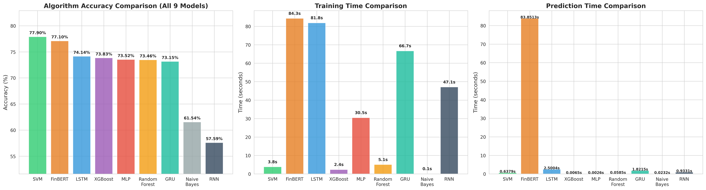
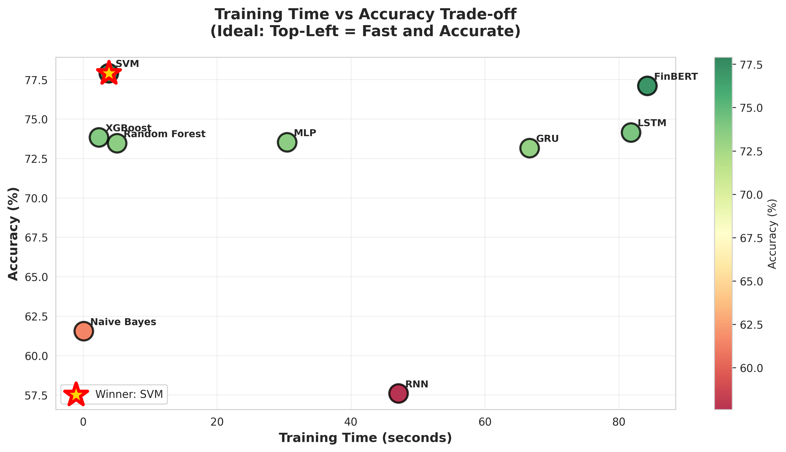
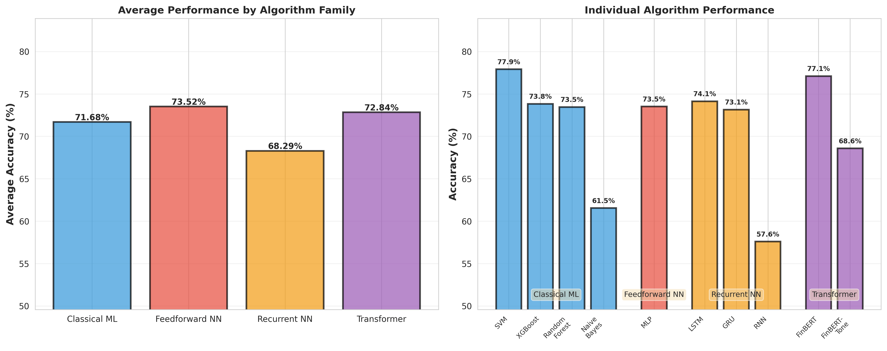

# Financial Sentiment Analysis: a controlled comparison of 9 algorithms

Which algorithm should classify the sentiment of a financial headline? I did not want to
answer that from a blog post, so I ran the comparison myself: nine algorithms spanning
classical machine learning, recurrent neural networks and a transformer, on one
deduplicated, class-balanced dataset, under identical preprocessing.

**The short answer: a linear SVM won, and it beat FinBERT a transformer pre-trained on
financial text, while training in under four seconds instead of eighty-four.**

This is self-directed work, not a set assignment. I set the question and ran it to decide
which model to put into a sentiment pipeline I was building.

---

## Results

All nine models trained and evaluated on the same 8,100-sample balanced dataset, same
80/20 split, same seed.

| Rank | Algorithm | Family | Accuracy | Train (s) | Predict (s) |
|---:|---|---|---:|---:|---:|
| 1 | **SVM** | classical | **77.90%** | 3.83 | 0.6379 |
| 2 | FinBERT | transformer | 77.10% | 84.28 | 83.8513 |
| 3 | LSTM | recurrent | 74.14% | 81.84 | 2.5004 |
| 4 | XGBoost | classical | 73.83% | 2.36 | 0.0065 |
| 5 | MLP | feedforward | 73.52% | 30.47 | 0.0026 |
| 6 | Random Forest | classical | 73.46% | 5.07 | 0.0585 |
| 7 | GRU | recurrent | 73.15% | 66.69 | 1.8215 |
| 8 | Naive Bayes | classical | 61.54% | 0.09 | 0.0232 |
| 9 | RNN | recurrent | 57.59% | 47.11 | 0.9331 |

Chance is 33.3%, because the classes were balanced deliberately — see below.

A tenth model was tested as a variant: **FinBERT-Tone reached 68.58%** once its label
encoding was corrected. It is left out of the ranking because it is a second version of
FinBERT rather than a distinct algorithm.

FinBERT is used **zero-shot**, with no fine-tuning, so its "train" time is really the cost of
running inference over the test set.



---

## What the numbers mean

**The transformer did not pay for itself.** FinBERT scored 0.80 percentage points below the
SVM while taking about 22x longer. Pre-training on financial text is an advantage on paper;
on 8,100 short headlines, used without fine-tuning, it did not show up. The practical read is
that a pre-trained model is not automatically the right choice, it has to earn the compute
it costs.

**Sample size, not architecture, is the binding constraint.** The best recurrent model landed
3.76 points behind a model that trains in under four seconds. Recurrent networks are
data-hungry, and 8,100 samples is well below where they usually become competitive. The
result is not that LSTMs are bad; it is that this dataset is too small for them.

**Gating is worth 16.55 points.** RNN at 57.59% against LSTM at 74.14%, on identical data,
preprocessing, seed and epoch count. The only difference is the recurrent cell. Plain RNNs
lose the start of a sentence by the time they reach the end; the gated variants do not, which
matters for headlines like "strong earnings **but** missed forecasts".

**Naive Bayes is the honest floor.** It is 16 points behind the winner and trains in
under a tenth of a second. That is what a baseline is for, it tells you how much of the accuracy is the
problem being easy versus the model being good.

---

## The methodological step that makes this comparison mean anything

The combined sources held 9,000 rows, of which **504 were duplicate sentences (5.6%)** and
some duplicates carried *conflicting labels*, the same sentence marked negative in one row and
neutral in another. The data was also imbalanced: 54% neutral, 32% positive, 14% negative.

Both of those break a comparison, in different ways:

- **Duplicates leak across the train/test split.** A sentence seen in training can reappear
  in test. A model with the capacity to memorise then scores higher than a model that
  generalises, and the comparison rewards the wrong thing. This hits high-capacity models
  hardest, exactly the class of model the comparison is trying to judge fairly.
- **Imbalance makes accuracy unreadable.** At 54% neutral, a model that predicts "neutral"
  every time scores 54% and has learned nothing.

So before any model was trained:

1. Deduplicated **8,496** unique samples remained.
2. Downsampled each class to 2,700 — **8,100 samples, exactly 33.3% per class.**
3. Applied one preprocessing pipeline to all of it, once: lowercase → strip punctuation →
   tokenise → remove stopwords → lemmatise → label-encode → TF-IDF (5,000 features).
4. Split 80/20 → 6,480 train, 1,620 test.

Downsampling was chosen over upsampling on purpose. Upsampling a deduplicated dataset puts
the duplicates straight back in, which is the problem step 1 removed.

**This is why my recurrent-network numbers are lower than published results on the same
dataset.** Comparable studies report LSTM around 79.8% and GRU around 80.6% on Financial
PhraseBank. Those studies did not deduplicate, and some upsampled to balance. The telling
detail is that my **Naive Bayes matched** the published 62% almost exactly at 61.54%, a
low-capacity model cannot exploit duplicates, so it was never inflated in the first place.
The baseline agreeing while the neural networks disagree is what points at the duplicates.

---

## Two debugging findings worth keeping

**A score below chance is a bug, not a bad model.** FinBERT-Tone first came out at **18.46%**,
well under the 33.3% chance line. Nothing is genuinely that much worse than guessing. The
cause was label order: the model emits Neutral/Positive/Negative and it was being scored
against positive/negative/neutral. Correcting the mapping moved it to **68.58%** 50 points
of apparent model quality that was really an indexing mistake.

**Reproducibility had to be added.** The three recurrent models originally set no random seed,
so every run produced different accuracies. They are now seeded, and every result table and
figure in the notebook is **computed from the models at run time** rather than typed in. Run
it twice and you get the same numbers.

---

## The other figures



Training cost against accuracy. The top-left corner is where you want to be, and SVM is the
only model in it. FinBERT reaches almost the same accuracy at the far right of the chart.



Every model grouped by family: classical, feedforward, recurrent, transformer.

---

## Running it

```bash
pip install -r requirements.txt
jupyter notebook algorithm_comparison.ipynb
```

The notebook is committed **with its outputs**, so every number and figure above can be read
without running anything. Training times will vary with your hardware; accuracies should not.

### The dataset is not in this repository

`data_cleaned.csv` is derived from the **Financial PhraseBank**, which is licensed
**CC BY-NC-SA 3.0** non-commercial, attribution, share-alike. A derived file inherits
share-alike, so it is deliberately not redistributed here. Get the sources directly:

- **Financial PhraseBank** — Malo, P., Sinha, A., Korhonen, P., Wallenius, J. and Takala, P.
  (2014), *Good debt or bad debt: Detecting semantic orientations in economic texts*,
  Journal of the Association for Information Science and Technology, 65(4).
  [Dataset on Hugging Face](https://huggingface.co/datasets/takala/financial_phrasebank)
- **FiQA 2018 Task 1** — aspect-based financial sentiment.
  [Task page](https://sites.google.com/view/fiqa/home)

To rebuild `data_cleaned.csv`: concatenate the two sources, drop exact duplicate sentences,
and save with `Sentence` and `Sentiment` columns. The notebook does the balancing itself.

---

## What is in here

```
algorithm_comparison.ipynb   the full experiment, 75 cells, outputs kept
figures/                     the three figures the notebook produces
requirements.txt             what it needs to run
```

---

## Attribution and licence

Written by Zee as part of an MSc in Artificial Intelligence, November–December 2025.
Re-run in September 2026 with seeded models and computed result tables.

The code in this repository is MIT licensed (`LICENSE`). The **datasets are not mine to
license** — Financial PhraseBank is CC BY-NC-SA 3.0 and is not included here. FinBERT is
[ProsusAI/finbert](https://huggingface.co/ProsusAI/finbert), used unmodified for inference.
